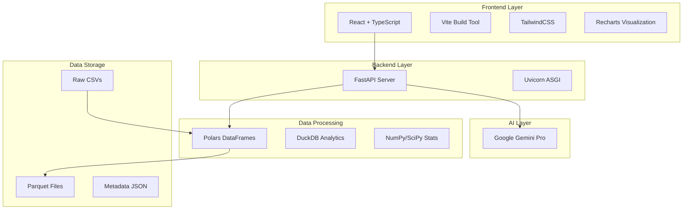
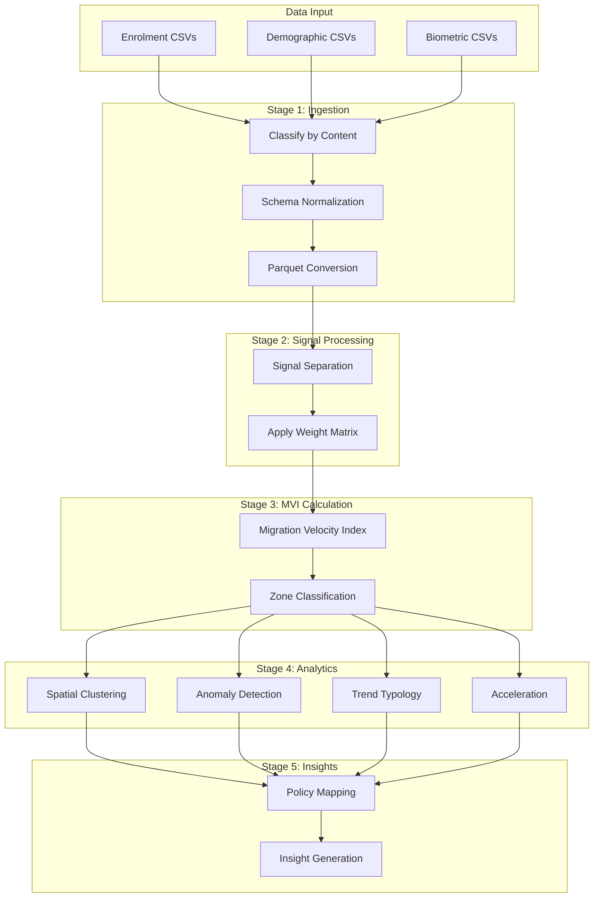
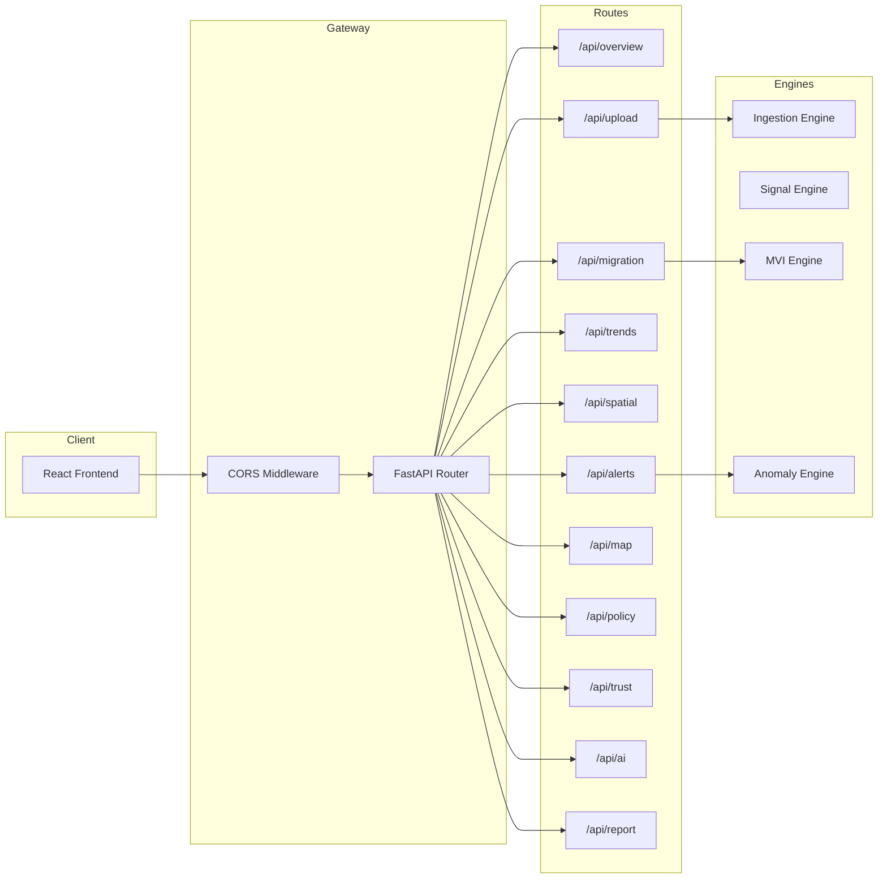
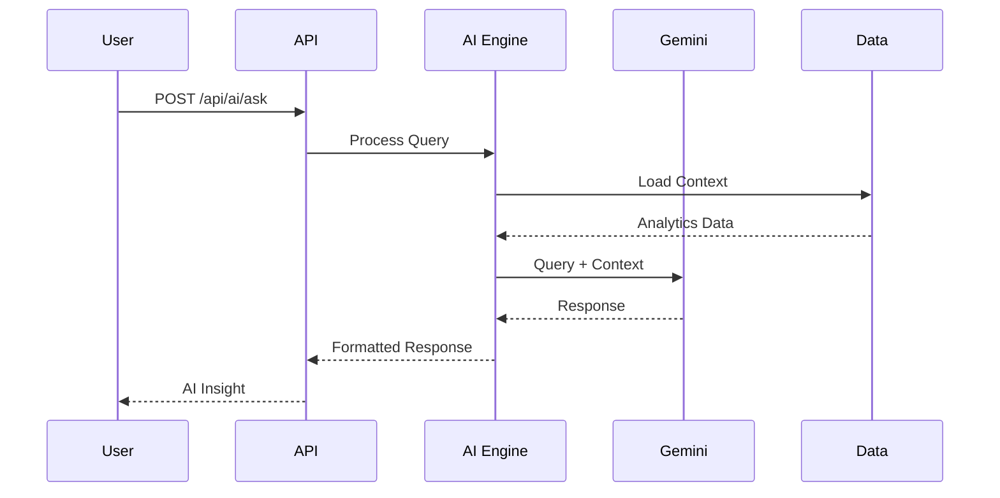
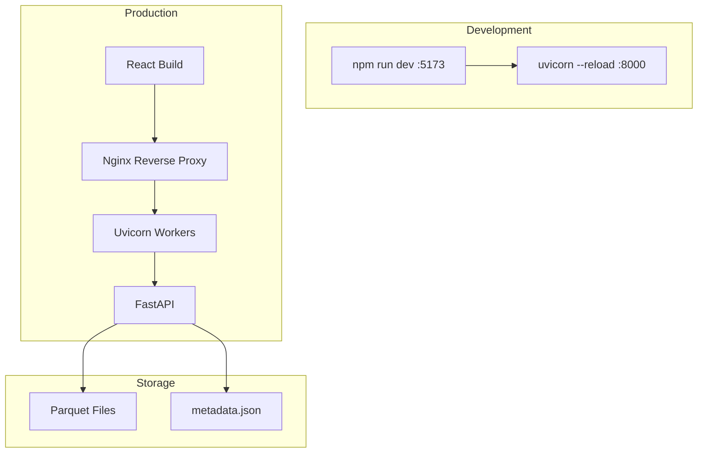

# Aadhaar Sanket - System Architecture

## Overview

Aadhaar Sanket is a Demographic Intelligence Dashboard that processes Aadhaar enrollment and update data to detect migration patterns, identify high-pressure zones, and generate actionable policy recommendations.

## Technology Stack



## Component Details

### Frontend (React + TypeScript)

| Technology | Purpose |
|------------|---------|
| React 18 | UI Framework |
| TypeScript | Type Safety |
| Vite | Build & Dev Server |
| TailwindCSS | Styling |
| Recharts | Data Visualization |
| React Router | Navigation |

### Backend (Python FastAPI)

| Technology | Purpose |
|------------|---------|
| FastAPI | REST API Framework |
| Uvicorn | ASGI Server |
| Polars | High-performance DataFrames |
| NumPy/SciPy | Statistical Calculations |
| Google Generative AI | AI Insights |

## Data Pipeline Architecture



## Engine Specifications

### 1. Data Ingestion Engine

**Purpose:** Classify CSVs by content and convert to optimized Parquet format.

**Classification Logic:**
```
ENROLMENT_INDICATORS: ['age_0_5', 'age_5_17', 'age_18']
DEMOGRAPHIC_INDICATORS: ['demo_age', 'demo_']  
BIOMETRIC_INDICATORS: ['bio_age', 'bio_']
```

**Output:** `*_clean.parquet` files in `/processed/`

### 2. Signal Separation Engine

**Purpose:** Separate meaningful migration signals from administrative noise.

**Weight Matrix:**
```
┌──────────────────────┬────────┬─────────────────────────────┐
│ Signal Type          │ Weight │ Reasoning                   │
├──────────────────────┼────────┼─────────────────────────────┤
│ demographic_adult    │ 1.0    │ Address change = migration  │
│ demographic_youth    │ 0.6    │ Family migration indicator  │
│ demographic_child    │ 0.4    │ Weaker signal               │
│ biometric_adult      │ 0.3    │ Could be renewal            │
│ biometric_child_5    │ 0.1    │ Mandatory update = noise    │
│ biometric_child_15   │ 0.1    │ Mandatory update = noise    │
└──────────────────────┴────────┴─────────────────────────────┘
```

**Formula:**
```
organic_signal = Σ(update_count × weight) for each geo_key
```

### 3. MVI Calculation Engine

**Purpose:** Calculate the Migration Velocity Index - the primary metric.

**Formula:**
```
MVI = (Signal-Adjusted Updates / Total Population Base) × 1000
```

**Zone Classification:**
```
┌───────────────────┬────────────┬─────────────────────────┐
│ Zone Type         │ MVI Range  │ Interpretation          │
├───────────────────┼────────────┼─────────────────────────┤
│ stable            │ < 5        │ Minimal change          │
│ moderate_inflow   │ 5 - 15     │ Normal activity         │
│ elevated_inflow   │ 15 - 30    │ Increased pressure      │
│ high_inflow       │ ≥ 30       │ Critical pressure       │
└───────────────────┴────────────┴─────────────────────────┘
```

**Confidence Levels:**
- High: population > 100,000
- Medium: 50,000 < population ≤ 100,000
- Low: population ≤ 50,000

### 4. Anomaly Detection Engine

**Purpose:** Detect statistical anomalies using rolling z-scores.

**Formula:**
```
z_score = (current_value - rolling_mean) / rolling_std
```

**Severity Classification:**
```
┌──────────┬──────────────┬─────────────────────────┐
│ Severity │ Z-Score      │ Action Required         │
├──────────┼──────────────┼─────────────────────────┤
│ CRITICAL │ |z| > 4.0    │ Immediate attention     │
│ HIGH     │ |z| > 3.0    │ Priority investigation  │
│ MEDIUM   │ |z| > 2.0    │ Monitor closely         │
│ LOW      │ |z| > 1.5    │ Track for patterns      │
└──────────┴──────────────┴─────────────────────────┘
```

**Anomaly Types:**
- SPIKE: z > 3 (sudden increase)
- DROP: z < -3 (sudden decrease)
- STRUCTURAL: sustained deviation > 3 consecutive periods
- TRANSIENT: isolated single-period event

### 5. Trend Typology Engine

**Purpose:** Classify regions into behavioral archetypes.

**Classification Logic:**
```
┌────────────────────┬─────────────────────────────────────────┐
│ Trend Type         │ Condition                               │
├────────────────────┼─────────────────────────────────────────┤
│ persistent_inflow  │ slope > 2.0 AND variance < 2.0          │
│ emerging_inflow    │ slope > 1.0 AND acceleration > 0.5      │
│ volatile           │ variance > 10.0                         │
│ reversal           │ slope < -0.5 AND previous_slope > 0.5   │
│ stable             │ |slope| < 0.5 AND variance < 2.0        │
└────────────────────┴─────────────────────────────────────────┘
```

### 6. Acceleration Engine

**Purpose:** Measure rate of change in migration patterns.

**Formula:**
```
acceleration = recent_slope - historical_slope

Where:
  recent_slope = regression over last 30% of data
  historical_slope = regression over first 70% of data
```

**Status Classification:**
- accelerating: acceleration > 0.5
- stable: -0.5 ≤ acceleration ≤ 0.5
- decelerating: acceleration < -0.5

### 7. Policy Mapper Engine

**Purpose:** Map analytics to actionable policy recommendations.

**Mapping Matrix:**
```
┌────────────────────┬──────────┬─────────────────────────────────┐
│ Pattern            │ Priority │ Primary Action                  │
├────────────────────┼──────────┼─────────────────────────────────┤
│ high_inflow        │ CRITICAL │ Initiate Emergency Planning     │
│ persistent_inflow  │ HIGH     │ Augment Urban Infrastructure    │
│ emerging_inflow    │ HIGH     │ Capacity Expansion Planning     │
│ volatile           │ MEDIUM   │ Deploy Real-time Monitoring     │
│ reversal           │ MEDIUM   │ Commission Detailed Analysis    │
│ stable             │ LOW      │ Continue Standard Operations    │
└────────────────────┴──────────┴─────────────────────────────────┘
```

## API Architecture



## Data Schema

### Input Data (CSV)

**Enrolment Data:**
```
date, state, district, pincode, age_0_5, age_5_17, age_18_greater
```

**Demographic Data:**
```
date, state, district, pincode, demo_age_5_17, demo_age_17_
```

**Biometric Data:**
```
date, state, district, pincode, bio_age_5_17, bio_age_17_
```

### Output Data (Parquet)

**mvi_analytics.parquet:**
```
geo_key, state, district, mvi, zone_type, confidence,
population_base, organic_signal, raw_updates, noise_ratio
```

**typology_analytics.parquet:**
```
geo_key, state, district, mvi, slope, variance, acceleration,
trend_type, zone_type, confidence, explanation
```

**policy_recommendations.parquet:**
```
geo_key, state, district, mvi, zone_type, trend_type,
priority, action_type, primary_action, reasoning
```

## AI Integration



**AI Capabilities:**
- Natural language queries about data
- Region-specific trend explanations
- Executive summary generation
- Policy recommendation enhancement

## Deployment Architecture



## Performance Considerations

1. **Polars over Pandas**: 10-100x faster for large datasets
2. **Parquet Format**: Columnar storage with compression
3. **Lazy Evaluation**: Polars query optimization
4. **Caching**: Processed data cached in Parquet
5. **Async API**: Non-blocking request handling

## Security Features

1. **CORS Configuration**: Restricted origins
2. **Input Validation**: Pydantic models
3. **Error Handling**: Custom exceptions
4. **Environment Variables**: Sensitive data protection
5. **No Raw SQL**: ORM/DataFrame operations only
